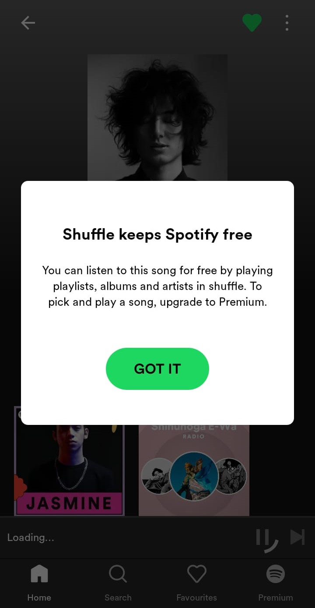
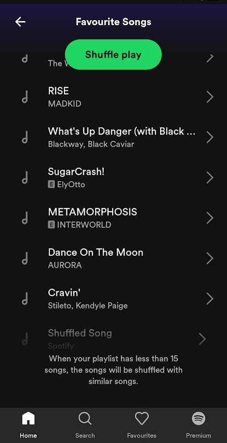

# Spotify pushing 'Shuffle-Only' Song Restrictions on Non-Premium users

*Note: the following is merely an attempt of mine at writing a news article.*

A user of Spotify, [tweeted on Twitter](https://twitter.com/aryanbaburajan/status/1717898678227312980) of coming across a new update that removed users’ ability to select a specific song of their choice. Instead, they’d have to play a playlist on shuffle and hope that Spotify would at some point play their favorite song.

	

		
		While it’s possible that Spotify intends on removing this update, It seems to be on the hunt for any new feature that would make the user pay up. As not too long ago Spotify had also conducted tests of locking the lyrics behind a paywall – which was removed a few days afterwards.
	

	

		Considering that Spotify themselves have not released a statement on this nor have many people come across this update, it goes to show that this one user coming across it was a bug – which however doesn’t eliminate the likelihood that Spotify plans on enforcing this update to premium users.
		
	

